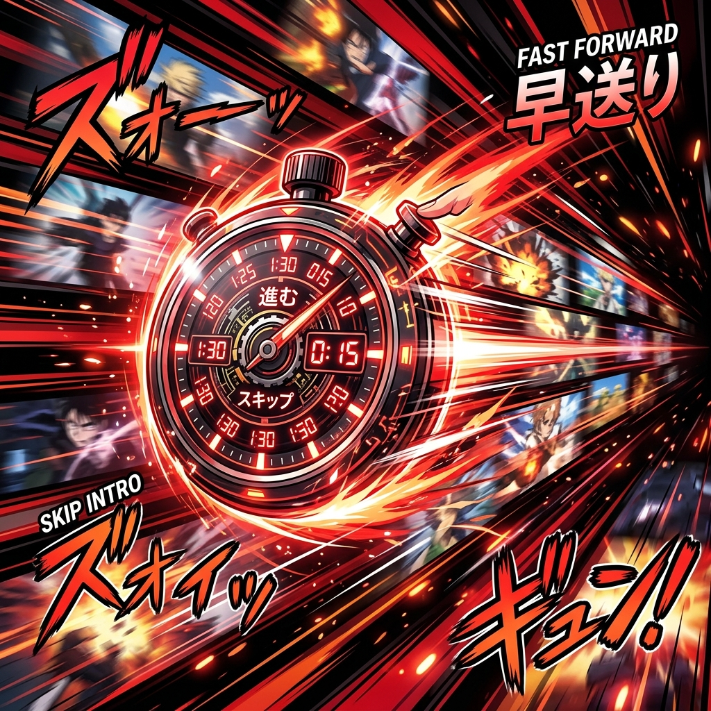

# 🎵 EchoSkip – Audio OST Skipper

Teach the script your anime's OP/ED once — it'll recognize and skip it forever! Uses real audio fingerprinting, not fragile timestamp databases. 🎧✨

### ✨ Magic Features
- **Acoustic Fingerprinting:** Records an 8-second audio signature via Web Audio API. No external APIs needed! 🎤
- **Pearson Correlation Engine:** Matches live audio against saved signatures with adjustable sensitivity. 🧮
- **One-Click Setup:** Hit "Record OP" during the opening, and you're set for the entire series. 🎯
- **Auto OP + ED Skip:** Detects both opening and ending themes independently.
- **Anti-Spoiler Guard:** Won't trigger during the last 2 minutes to protect post-credit scenes. 🛡️
- **Draggable GUI:** Moveable, minimizable, remembers position and state. 👻
- **Export/Import:** Share your signature library across devices or with friends. 📤📥
- **100% Local:** No audio data ever leaves your browser. 🔒
